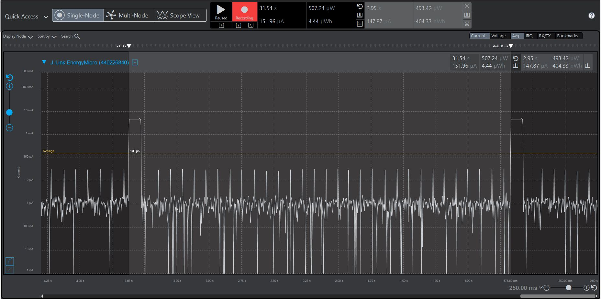
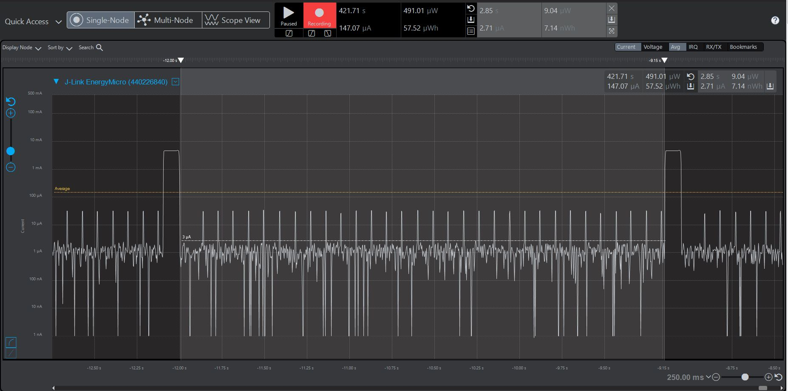
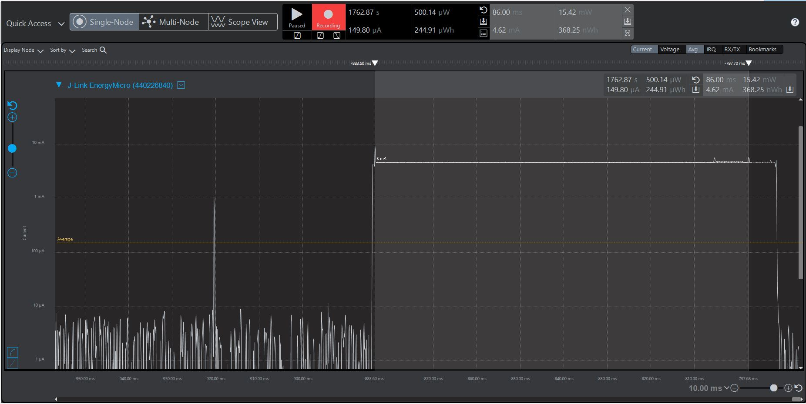
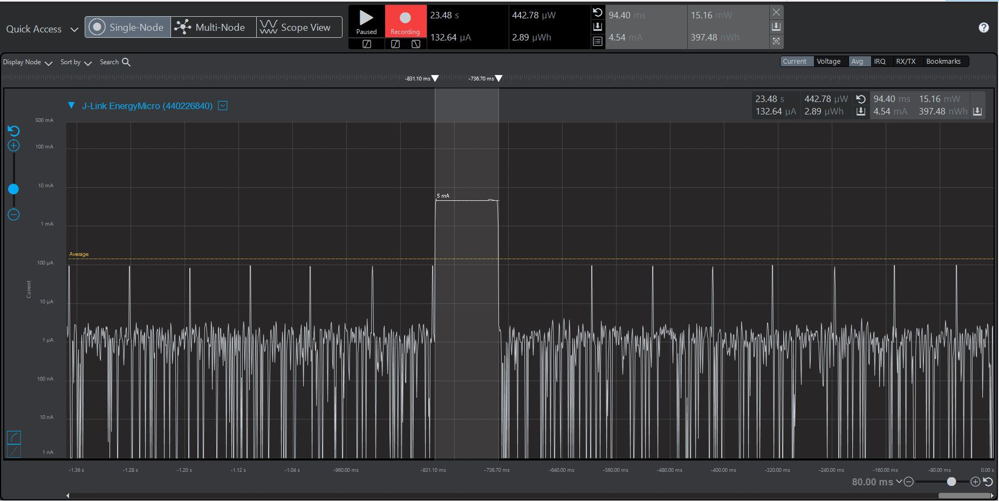

Please include your answers to the questions below with your submission, entering into the space below each question
See [Mastering Markdown](https://guides.github.com/features/mastering-markdown/) for github markdown formatting if desired.

*Be sure to take measurements with logging disabled to ensure your logging logic is not impacting current/time measurements.*

*Please include screenshots of the profiler window detailing each current measurement captured.  See the file: Instructions to add screenshots in assignment.docx in the ECEN 5823 Student Public Folder.* 

1. What is the average current per period? (Remember, once you have measured your average current, average current is average current over all time. Average current doesn’t carry with it the units of the timespan over which it was measured).
   Answer: 147.87 uA
    Screenshot:  
     
   
2. What is the ave current from the time we sleep the MCU to EM3 until we power-on the 7021 in response to the LETIMER0 UF IRQ? 
   Answer: 2.71 uA
    Screenshot:  
   
   
3. What is the ave current from the time we power-on the 7021 until the polled implementation of timerWaitUs() returns, indicating that the 7021's maximum time for conversion (measurement) has expired.
   Answer: 4.62 mA
    Screenshot:  
   
   
4. How long is the Si7021 Powered On for 1 temperature reading?  
   Answer: 94.40 ms
    Screenshot:  
   
