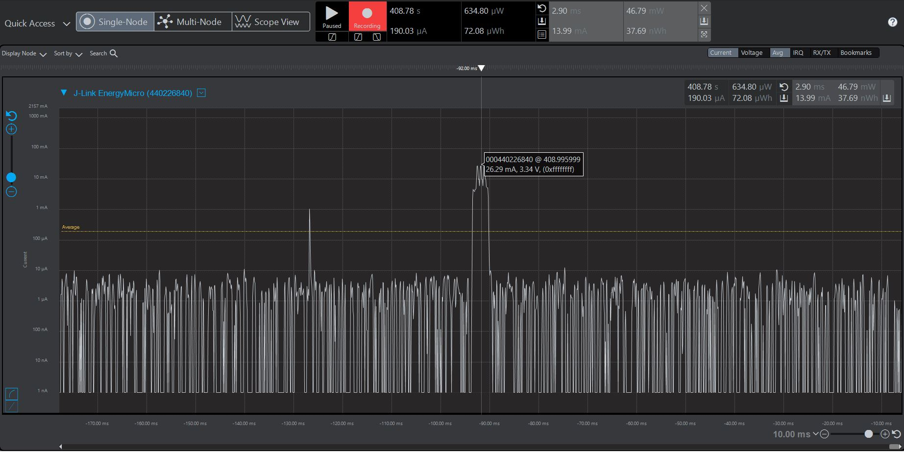
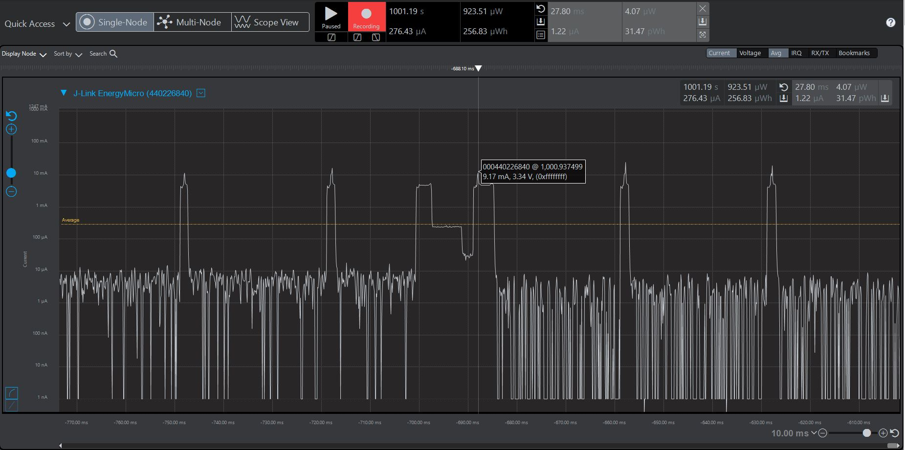

Please include your answers to the questions below with your submission, entering into the space below each question
See [Mastering Markdown](https://guides.github.com/features/mastering-markdown/) for github markdown formatting if desired.

*Be sure to take measurements with logging disabled to ensure your logging logic is not impacting current/time measurements.*

*Please include screenshots of the profiler window detailing each current measurement captured.  See the file Instructions to add screenshots in assignment.docx in the ECEN 5823 Student Public Folder.*

1. Provide screen shot verifying the Advertising period matches the values required for the assignment.
    Screenshot:  
     

2. What is the average current between advertisements - i.e. when the MCU is sleeping in EM2. (Don't measure an interval with a LETIMER UF event)?
   Answer: 2.03 uA
    Screenshot:  
     

3. What is the peak current of an advertisement? 
   Answer: 26.29 mA
    Screenshot:  
     

4. Provide screen shot showing the connection interval setting. Does the connection interval match the values you requested in your slave(server) code, or the master's(client) values?.
    Screenshot: 
     

5. What is the average current between connection intervals - i.e. when the MCU is sleeping in EM2. (Don't measure an interval with a LETIMER UF event)?
   Answer: 1.22 uA
    Screenshot:  
     

6. If possible, provide screen shot verifying the slave latency matches what was reported when you logged the values from event = gecko_evt_le_connection_parameters_id. 
   Explanation: Since the slave latency is 0, the slave will perform the transmit cycle on the latest upcoming event possible. It will not
   wait 4 connection cycles. 
    Screenshot:  
   
   ![slave_latency_putty] (screenshots/assignment5/slave_latency_putty.JPG)

